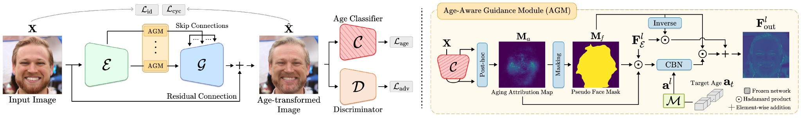

# Age-Aware Guidance via Masking-Based Attention in Face Aging
## [CIKM 2023 accepted]
## Overview


Face age transformation aims to convert reference images into synthesized images so that they portray the specified target ages. The crux of this task is to change only age-related areas of the given image while maintaining the age-irrelevant areas unchanged. Nevertheless, a common limitation among most existing models is the struggle to generate high-quality aging images that effectively consider both crucial properties. To address this problem, we propose a novel GAN-based face-aging framework that utilizes age-aware Guidance via Masking-Based Attention (GMBA). Specifically, we devise an age-aware guidance module to adjust age-relevant and age-irrelevant attributes within the image seamlessly. By virtue of its capability, it enables the model to produce realistic age-transformed images that certainly preserve the input's identities while delicately imposing age-related properties. Experimental results show that our proposed GMBA outperformed other state-of-the-art methods in terms of identity preservation and accurate age conversion, as well as providing superior visual quality for age-transformed images.

## Setup

- Python 3.7.10
- CUDA Version 11.0

1. Nvidia driver, CUDA toolkit 11.0, install Anaconda.

2. Install pytorch
```
conda install pytorch torchvision cudatoolkit=11.0 -c pytorch
```

4. Install various necessary packages
```
pip install numpy tqdm
```

## Training

When using Terminal, directly execute the code below after setting the path


```
python main.py --gpu 0 --batch_size 64 --epochs 100
```
